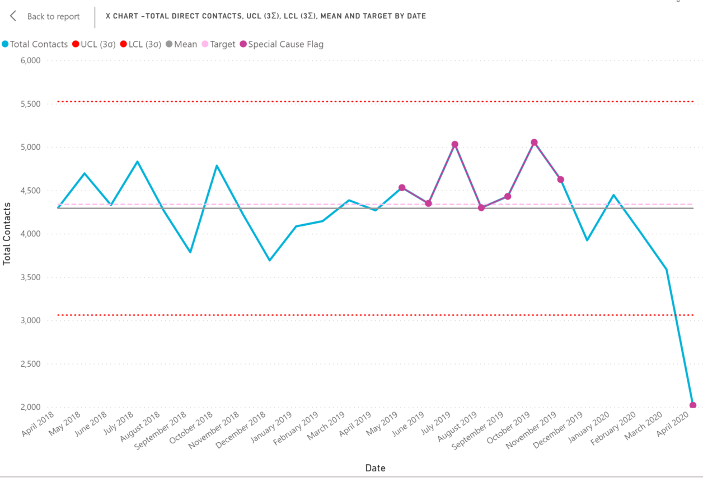
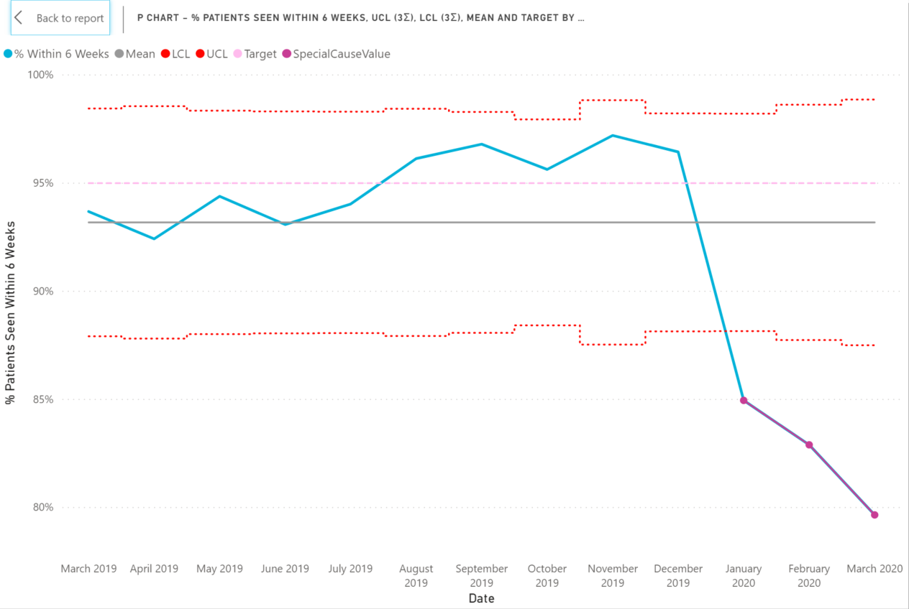
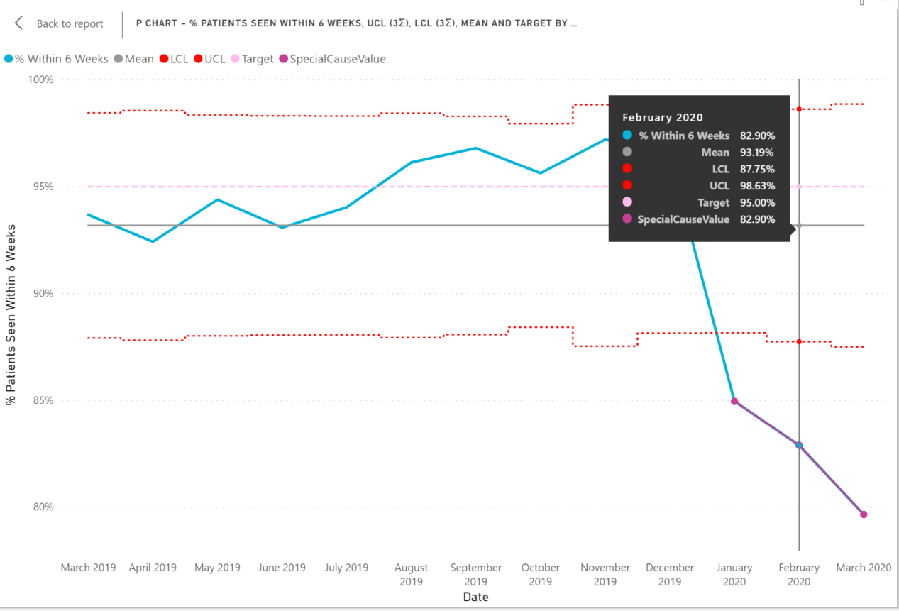

# statistical_process_control_SQL
The SQL code included provides a template to create statistical process control (SPC) charts.

SPC is a common statistical methodology used to monitor and control processes. It offers a clear indication of whether variation in a process is what can be described as 'common cause' variation - not statistically significant or 'special cause' - statistically significant variation that requires further attention. It is now commonly used in healthcare.

A more detailed overview of SPC methodology can be found here...

https://qi.elft.nhs.uk/wp-content/uploads/2018/10/Mohammed-et-al-2008-Plotting-basic-control-charts.pdf

**The SQL script is an adaptation of a query developed by NHS Improvement. The original work can be found here:**

https://improvement.nhs.uk/resources/structured-query-language-sql-statistical-process-control/

Some of the changes include:

 - Modified into a stored procedure to allow for repeated execution with different parameters.
 - Being able to set a baseline period for calculation of the mean and control limits (this was not a feature of the original). This is optimal as it means the control limits don't change every time new data is retrieved.
 - A modified version of the script that produces a P chart. The original only produced one type of SPC - the XmR chart (see above paper for more details on difference).
 
The queries can then be executed in any visualisation software. For example, below are screen shots of the output in Microsoft PowerBI. You can format the chart so the outliers are flagged, as well as any trends that trigger one of the SPC rules commonly flagged up.

XmR chart:

P chart:

